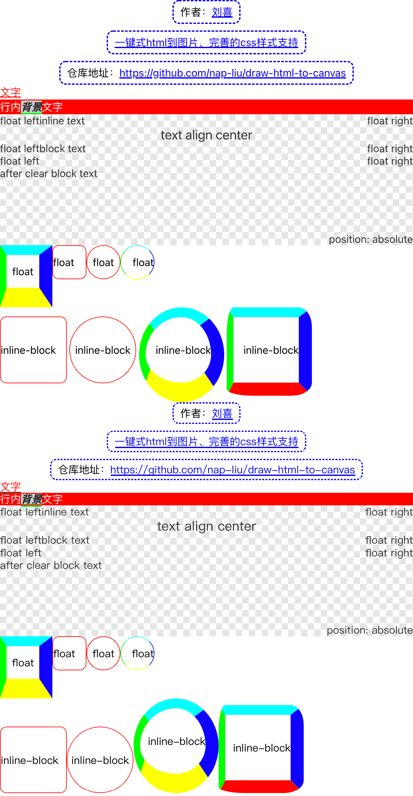
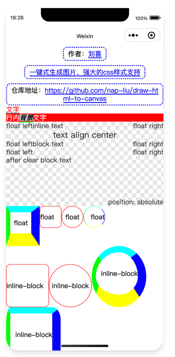
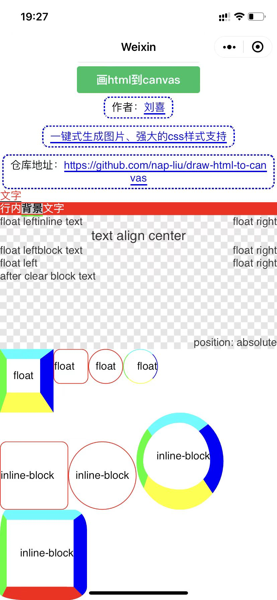

# draw html to canvas

使用html+css语法绘制图片到canvas上

## 安装

```
npm i draw-html-to-canvas --save
```

## 渲染效果

电脑端渲染效果图  
上半部分为浏览器效果  
下半部分为渲染效果



微信开发者工具渲染效果图  


微信真机渲染效果图


## 使用方法

### 纯页面使用方法

```html
<!DOCTYPE html>
<html lang="en">
<head>
  <meta charset="UTF-8">
  <meta http-equiv="X-UA-Compatible" content="IE=edge">
  <meta name="viewport" content="width=device-width, initial-scale=1.0">
  <title>draw html to canvas</title>
  <style>
    * {
      margin: 0;
      padding: 0;
    }

    #canvas {
      width: 100%;
      height: 100%;
    }
  </style>
</head>
<body>
<canvas id="canvas"></canvas>
</body>
<script src="node_modules/draw-html-to-canvas/dist/index.umd.js"></script>
<script>
  ;(async function() {
    const DrawHtml2Canvas = window.DrawHtml2Canvas.default;

    const html = `<div style="border: 1px solid #f00">draw to canvas</div>`;

    const render = DrawHtml2Canvas.fromHTML(html);

    // 设置网页最大宽度
    render.rootNode.style.set('width', '500px');

    const canvas = document.querySelector('#canvas');
    const ctx = canvas.getContext('2d');

    // 加载html中使用的图片
    await render.loadSource();

    // 计算布局
    render.layout(ctx);

    // 获取网页尺寸
    const {offsetWidth, offsetHeight} = render.rootNode;

    // 高清适配
    ctx.save();
    canvas.height = offsetHeight * window.devicePixelRatio;
    canvas.width = offsetWidth * window.devicePixelRatio;
    ctx.scale(window.devicePixelRatio, window.devicePixelRatio);

    // 绘制图像到canvas上
    render.draw(ctx);

    ctx.restore();
  })();
</script>
</html>

```

### web工程使用方法

```javascript
import Render from 'draw-html-to-canvas';

const html = `<div>draw to canvas</div>`
const render = Render.fromHTML(html);

const canvas = document.querySelector('#canvas');
const ctx = canvas.getContext('2d');

// 修改网页最大宽度为500px
render.rootNode.style.set('width', '500px');

// 加载html中使用的图片
await render.loadSource();

// 计算布局
render.layout(ctx);

// 获取网页尺寸
const {offsetWidth, offsetHeight} = render.rootNode;

// 高清适配
ctx.save();
canvas.height = offsetHeight * window.devicePixelRatio;
canvas.width = offsetWidth * window.devicePixelRatio;
ctx.scale(window.devicePixelRatio, window.devicePixelRatio);

// 绘制图像到canvas上
render.draw(ctx);

ctx.restore();
```

### 微信小程序

渲染效果的截图的代码片段  
最低支持1.9的基础库  
2.9以上可以使用同层渲染 推荐使用同层渲染api

[在线代码片段](https://developers.weixin.qq.com/s/R3tl79mc7ozj)

## 采用**float**布局系统

block 独占一行  
inline-block 行内布局超长自动换行  
inline 行内布局超长自动换行  
内置了常见的标签识别

## 支持标签

|标签支持|默认布局|默认行为|
|----|----|----|
|div|block|无|
|img|inline-block|img元素会自动加载图片|
|span|inline|无|

## 支持样式

|样式属性|有效值|特性|
|----|----|----|
|display|block\inline-block\inline|
|float|left\right|
|clear|任意值都是both|
|width|绝对值|
|height|绝对值|
|padding|绝对值|
|margin|绝对值\支持 margin: 0 auto; 居中对齐|
|position|relative\absolute|
|top|绝对值|绝对定位有效|
|right|绝对值|绝对定位有效|
|bottom|绝对值|绝对定位有效|
|left|绝对值|绝对定位有效|
|z-index|同block下所有的值拉平计算优先级|
|color|支持 rgba\rgb\#xxx\transparent|
|border|全功能|
|border-style|只支持 solid\dashed|
|border-radius|全功能|
|background|全功能 支持多重背景 简写、全写、支持线性渐变|
|font-style|绝对值|
|font-variant|绝对值|
|font-weight|绝对值|
|font-stretch|绝对值|
|font-size|绝对值|
|font-family|绝对值|
|text-decoration|全写、简写|
|text-decoration-color|color支持的范围|
|text-decoration-style|只支持 solid\double|
|text-decoration-thichness|绝对值|
|text-decoration-line|underline\overline\line-through|
|line-height|固定值、倍数|
|text-align|全功能|
|opacity|全功能|

## LiveDemo

[在线示例](https://draw-html-to-canvas.js-css.com)

